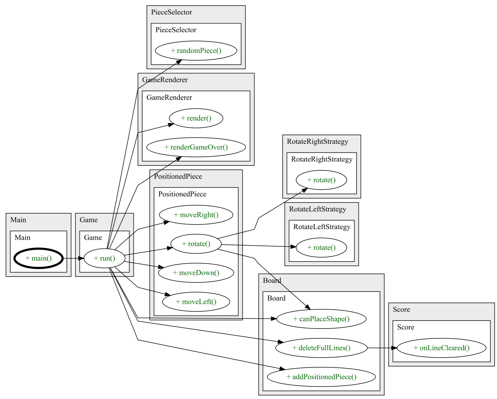

# Tetris 

O nosso jogo é uma recriação do clássico Tetris com algumas novidades estratégicas. O objetivo do jogador é posicionar peças de diferentes formas e cores em um tabuleiro de 10x20 para completar e eliminar linhas horizontais. Cada linha eliminada concede pontos, enquanto que erros tornam o jogo cada vez mais desafiador devido ao acumular de blocos.

Os jogadores podem acumular pontos para desbloquear bônus que permitem eliminar linhas ou áreas específicas, prolongando o jogo e aumentando as possibilidades estratégicas.

Este projeto foi desenvolvido por **[Filipe Camacho(up202208040@fe.up.pt),.....]** para a unidade curricular LDTS 2024/2025 na FEUP.

---

## CONTROLES

- **MOVIMENTAÇÃO**:
    - **Mover peça para a esquerda**: Seta Esquerda (←)
    - **Mover peça para a direita**: Seta Direita (→)
    - **Mover peça para baixo**: Seta para Baixo (↓)
    - **Rodar peça para a esquerda**: Tecla A
    - **Rodar peça para a direita**: Tecla D
    - **Mover peça para o fundo**: Tecla Espaço

- **BÔNUS**:
    - **Ativar bônus**: Tecla 

- **OUTROS**:
    - **Pausar o jogo**: Tecla P
    - **Reiniciar o jogo**: Tecla R

---
## FUNCIONALIDADES

- **Jogabilidade Clássica do Tetris**: Elimine linhas ao posicionar as peças no tabuleiro de 10x20.
- **Seleção Aleatória de Peças**: O jogo escolhe uma peça aleatória entre cinco formatos diferentes.
- **Sistema de Pontuação**: Receba pontos por cada linha eliminada.
- **Sistema de Bônus**: Use pontos acumulados para desbloquear bônus que ajudam a limpar linhas ou áreas críticas.
- **Registro de Tempo**: O jogo mede quanto tempo o jogador sobrevive.

---

## DIAGRAMA UML

