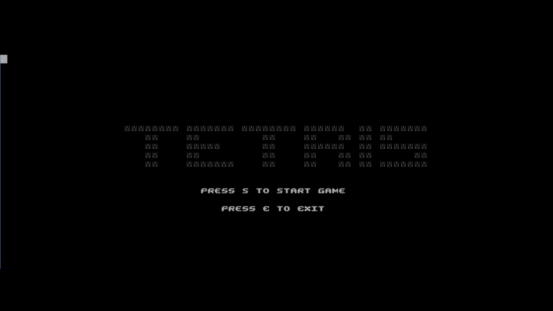
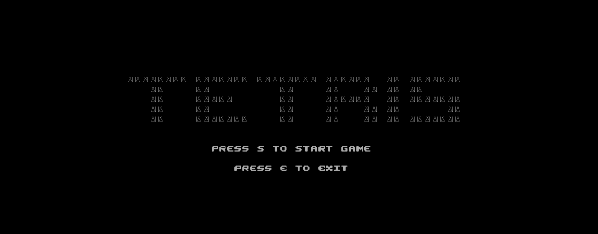
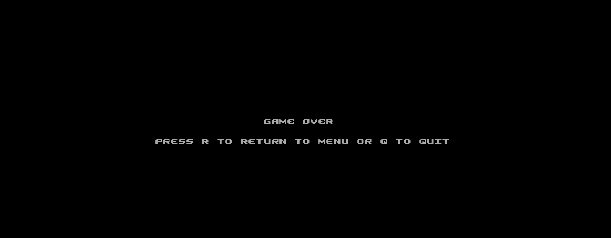
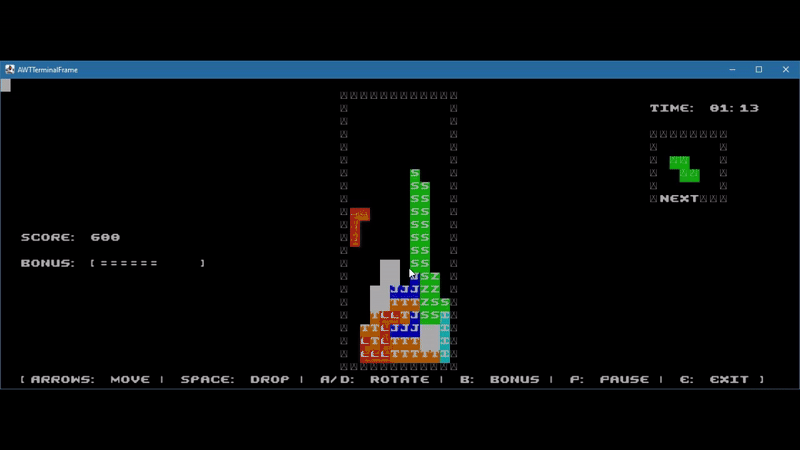

LDTS Tetris - T12G01
Descrição do Jogo

O nosso Tetris é uma versão do clássico puzzle de blocos em queda. O objetivo é organizar os tetraminós que caem, de forma a completar linhas horizontais que são imediatamente removidas. Cada linha removida aumenta a pontuação e a dificuldade do jogo. Com um sistema de bónus dinâmico, selecção de linhas em modo especial e a possibilidade de pausar, esta versão de Tetris oferece um desafio rápido e divertido.

Este projeto foi desenvolvido por [Filipe Camacho(up202208040@fe.up.pt),Carolina Roque(up202305062@fe.up.pt),Raul Oliveira(up202303446@fe.up.pt)]  no âmbito da unidade curricular LDTS 2024-25 na FEUP.

Para uma descrição mais detalhada: (docs/README.md)

Jogo

  
 
 <b><i>Gif 1. Pequena demonstração da gameplay do Tetris</i></b> 
  
Menus

  
 
 <b><i>Fig. 1. Menu Inicial</i></b> 
   
  
 
 <b><i>Fig. 2. Ecrã de Fim de Jogo</i></b> 
  
Jogabilidade
 
  
 
 <b><i>Gif 2. Modo de Bónus </i></b> 
  
