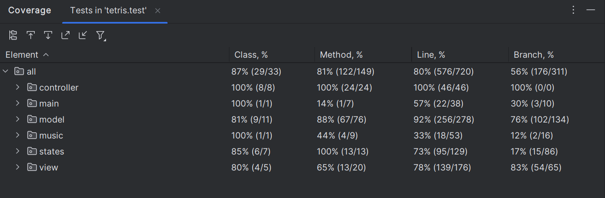

# LDTS_T12_G01 - TETRIS

## Descrição do jogo

O nosso jogo é uma recriação do clássico Tetris com algumas novidades estratégicas. O objetivo do jogador é posicionar peças de diferentes formas e cores em um tabuleiro de 10x20 para completar e eliminar linhas horizontais. Cada linha eliminada concede pontos, enquanto que erros tornam o jogo cada vez mais desafiador devido ao acumular de blocos.

Os jogadores podem acumular pontos para desbloquear bônus que permitem eliminar linhas ou áreas específicas, prolongando o jogo e aumentando as possibilidades estratégicas.

Este projeto foi desenvolvido por **[Filipe Camacho(up202208040@fe.up.pt),Carolina Roque(up202305062@fe.up.pt),Raul Oliveira(up202303446@fe.up.pt)]** para a unidade curricular LDTS 2024/2025 na FEUP.

## Features Implementadas

- **GameModel** - Gere o jogo incluindo o tabuleiro, a pontuação(score), as peças(pieces) ativas, o sistema de bônus(bonus) e o estado de pausa do jogo.
- **Board** - Representado por uma matriz bidimensional 10x20 onde cada célula contém um caractere(char) e uma cor(TextColor). Possui funcionalidades que permitem manipular o estado do jopgo, como adicionar e mover peças, verificar o preenchimento de linhas completas e removê-las, e deteção do fim do jogo.
- **Gerador de peças aleatórias** - Sistema que fornece peças predefinidas (O, I, T, J, L) com cores distintas e permite gerar peças aleatórias, garantindo imprevisibilidade ao jogo.
- **Deteção de colisões de peças** - Verificação se as peças atingem outras no tabuleiro ou caso ultrapassem os limites do tabuleiro, impedindo movimentos inválidos.
- **PieceSelector** - Define as formas e cores das peças. Essas peças podem ser geradas aleatoriamente e o jogo possui cinco formas de peças predefinidas que são ultilizadas no jogo de mode a que o jogador consiga formar linhas completas.
- **Comandos** - Uso do Command Pattern para abstrair e encapsular ações como movimento, rotação e pausa do jogo.
- **Gestão de Estados** - Separação clara entre estados do jogo, como menu principal, jogo ativo, pausa e fim de jogo.
- **Movimento e Rotação de Peças** - As peças podem ser movidas para a esquerda, direita e para baixo. Além disso, as peças podem ser rotacionadas para a esquerda e para a direita. Desta forma, o jogador consegue controlar a posição da peça atual durante a sua queda.
- **Remoção de Linhas Completas** - Deteta e remove linha totalmente preenchidas e as linhas superiores deslocam-se para baixo e o jogador ganha pontos.O sistema notifica os observadores quando uma linha é limpa, para atualizar o placar do jogo, como a pontuação.
- **Sistema de pontuação** - O jogo possui um sistema de pontuação(score), que será atualizado à medida que cada linha é removida.
- **Sistema de Bônus** - Use pontos acumulados para desbloquear bônus que ajudam a limpar linhas ou áreas críticas.
- **Registo de Tempo**: O jogo mede quanto tempo o jogador sobrevive.
- **Animações e efeitos** - Inclui animações de desaparecimento de linhas e efeitos de som para ações como a rotação e eliminação de linhas.
- **Testes** - O códigos conta com vários testes automatizados que verificam desde a movimentação das peças até a remoção de linhas e cálculo da pontuação.
- **Música de fundo.**

## CONTROLOS

- **MOVIMENTAÇÃO**:
    - **Mover peça para a esquerda**: Seta Esquerda (←)
    - **Mover peça para a direita**: Seta Direita (→)
    - **Mover peça para baixo**: Seta para Baixo (↓)
    - **Rodar peça para a esquerda**: Tecla A
    - **Rodar peça para a direita**: Tecla D
    - **Mover peça para o fundo**: Tecla Espaço

- **BÔNUS**:
    - **Ativar bônus**: Tecla b

- **OUTROS**:
    - **Pausar o jogo**: Tecla P
    - **Reiniciar o jogo**: Tecla R

## Features planeadas

Todas as features planeadas foram implementadas com sucesso.

## Design

### Estrutura Geral
### Problema no Contexto:
O jogo Tetris exige uma arquitetura modular e extensa para lidar com as diversas interações entre peças, tabuleiro e eventos do jogo. Para atender a esses requisitos, foram utilizados padrões de design adequados para resolver problemas como detecção de eventos, rotação de peças e controle de estados.

#### O Padrão:
O **_Architectural Pattern_** Model-View-Controller(MVC) que é normalmente usado em uma GUI divide-se em três componentes: Model: Armazena o estado do jogo, incluindo a lógica e os dados (como o tabuleiro, peças, pontuação, etc.); View: Responsável por exibir o estado do jogo na tela, renderizando as peças e o tabuleiro; e Controller: Gerencia a interação do usuário, interpretando as entradas (como movimentos do teclado e mouse) e atualizando o modelo de acordo.
#### Implementação:
No seu jogo, a estrutura MVC foi fundamental para organizar a interação entre as peças e o tabuleiro. O Modelo armazena a posição das peças, verifica as colisões e gerencia o estado do jogo (como o término do jogo). A Visão é responsável por desenhar o tabuleiro e as peças na tela, enquanto o Controlador captura as entradas do jogador (teclas de movimento, rotação) e atualiza o modelo e a visão.
//UML

#### Consequências:
O uso do padrão MVC permite: 
- Manutenção Simplificada: A separação de responsabilidades facilita a manutenção e a evolução do código. Mudanças no comportamento do modelo (como a forma de verificar colisões) podem ser feitas sem impactar diretamente a interface ou o controlador.
- Facilidade para Alterações Visuais: A View pode ser alterada sem a necessidade de modificar a lógica de jogo central, permitindo a alteração da interface (como a adição de novos efeitos gráficos) de forma independente.
- A estrutura modular facilita a expansão do jogo. Novos recursos, como novas peças ou modos de jogo, podem ser facilmente integrados ao modelo sem prejudicar a visão ou o controle.

### State 
#### Problema em Contexto:
Durante o desenvolvimento, surgiu a necessidade de gerenciar diferentes estados do jogo, como em andamento, pausa ou game over. Inicialmente, esses estados eram controlados por diversas flags dispersas no código, o que tornava difícil entender e modificar o fluxo do jogo.

#### O Padrão:
O **_State Pattern_** encapsula estados específicos como objetos separados e delega o comportamento a esses estados, reduzindo a complexidade de controle do fluxo.

#### Implementação:
State Pattern pode ser utilizado para representar diferentes estados do jogo, como:
- Estado de Jogo Ativo: O jogo está em andamento, com o jogador a mover as peças.
- Estado de Pausa: O jogo foi colocado em pausa e o jogador não pode interagir com o tabuleiro.
- Estado de Game Over: O jogo terminou e o jogador não pode mais realizar movimentos.

#### Consequência:
- Simplicidade na Adição de Novos Estados: A adição de novos estados ao jogo pode ser feita facilmente sem modificar as condições de controle do jogo, já que cada estado tem seu comportamento encapsulado.
- Menor Complexidade no Controle de Fluxo: A lógica do jogo não precisa mais de uma série de verificações manuais de flags para determinar em que estado o jogo se encontra. O comportamento do jogo muda automaticamente quando o estado é alterado.
- Facilidade para Testes: Cada estado pode ser testado de forma isolada, o que facilita a verificação do comportamento do jogo em diferentes condições sem depender de estados anteriores ou posteriores.

### Observer and Listeners
#### Problema no Contexto:
O jogo depende de interações contínuas do jogador, como movimentos de peças e cliques de botão. Gerenciar esses inputs de maneira eficiente, sem sobrecarregar o sistema com verificações excessivas, foi um dos desafios. A solução seria um mecanismo que notifique automaticamente as mudanças, evitando chamadas desnecessárias. Além disso, quando o jogador completa uma linha no tabuleiro, o sistema de pontuação precisa ser atualizado automaticamente sem que o código fique excessivamente acoplado.

#### O Padrão:
O **_Observer pattern_** foi aplicado para que o jogo pudesse responder a mudanças de estado, como entradas do usuário, sem precisar fazer verificações constantes. Permite que diferentes componentes do sistema, como o sistema de pontuação, sejam atualizados automaticamente quando certos eventos ocorrerem, como a conclusão de uma linha no tabuleiro. 

#### Implementação:
No seu jogo, o Observer Pattern é utilizado para notificar componentes relevantes sobre eventos importantes. Por exemplo, sempre que uma linha é completamente preenchida no tabuleiro, o modelo (que representa o estado do jogo) notifica os observadores, como o sistema de pontuação, para que ele atualize a pontuação do jogador. O modelo verifica se uma linha foi preenchida e emite a notificação. Os observadores, isto é, o sistema de notificação que está inscrito no modelo, reage à notificação atualizando a pontuação do jogador.
A implementação pode ser visualizada de forma simplificada como um sistema onde o modelo gera um evento e qualquer componente inscrito como observador, como o sistema de pontuação, é notificado e age em conformidade.

#### Consequências:
- O uso do Observer elimina a necessidade de acoplamento direto entre os componentes. Por exemplo, o modelo não precisa saber detalhes sobre como o sistema de pontuação ou o controlador funcionam, apenas notifica os eventos.
- Novos observadores, como um sistema de animações ou notificações visuais, podem ser adicionados facilmente sem alterar o modelo ou outros componentes existentes.

### Factory Pattern
#### Problema no Contexto:
Criar peças do Tetris e compor o tabuleiro com seus elementos requer um sistema flexível para gerar objetos complexos.

#### O Padrão:
Foi implementado o **_Factory Pattern_** para gerenciar a criação de peças. Este padrão define uma interface para criar um objeto, mas deixa que as subclasses decidam qual classe instanciar.

#### Implementação
No seu jogo, o Factory Method pode ser utilizado para criar as diferentes peças do Tetris. Cada tipo de peça (como o L, T, O, I, etc.) pode ser gerado por uma fábrica que decide qual classe de peça criar com base em algum critério (como a aleatoriedade ou o nível do jogo).

#### Consequências
- Desacoplamento entre a criação e o uso das peças: A lógica de criação das peças é centralizada, permitindo que a adição de novas peças seja feita de forma isolada. O código que utiliza as peças não precisa de saber detalhes sobre como as peças são criadas.
- Facilidade a introduzir novos tipos de peças: Caso novas peças sejam introduzidas, basta criar uma nova classe e atualizar a fábrica, sem alterar o restante do código do jogo.
- Maior Flexibilidade: O padrão permite que a lógica de criação de peças seja facilmente adaptada, como adicionar variações ou características especiais a novas peças sem complicar o código existente.

### Strategy Pattern
#### Problema em Contexto:
A criação de peças precisa ser centralizada e consistente para manter a integridade do jogo.
No jogo, as peças precisam ser rotacionadas tanto para a esquerda quanto para a direita, e a lógica para realizar essas rotações não é idêntica. Cada direção de rotação exige alterações no estado da peça e no tabuleiro, já que a rotação para a esquerda (anti-horária) e para a direita (horária) têm comportamentos diferentes, dependendo da configuração das peças no momento da rotação. Qualquer futura modificação nas regras de rotação exigiria alterações em toda a lógica central do código, criando um risco de introdução de bugs. A necessidade de manter essas rotações modulares e flexíveis, sem aumentar a complexidade do código, fez com que fosse necessário adotar uma abordagem mais robusta para gerenciar a variação de comportamentos de rotação.

#### O Padrão:
O **_Strategy Pattern_** é um padrão comportamental que permite encapsular diferentes algoritmos ou comportamentos (estratégias) em classes separadas e torná-los intercambiáveis. Ao invés de ter lógica condicional espalhada pelo código, o padrão permite que o comportamento seja alterado dinamicamente, sem modificar o código que o utiliza. Isso facilita a manutenção e a extensão do sistema.

#### Implementação:
Classes específicas como RotateLeftStrategy(Contém a lógica específica para rotacionar a peça no sentido anti-horário) e RotateRightStrategy(Contém a lógica específica para rotacionar a peça no sentido horário) implementam as lógicas de rotação, permitindo testes e manutenção mais fáceis.
A classe que gerencia o movimento das peças delega a rotação à estratégia selecionada, com base na entrada do jogador (se o jogador pressiona a tecla para girar para a esquerda ou para a direita). Usando o padrão Strategy, a lógica de rotação não é mais construída diretamente no controle do jogo, mas sim organizada em classes separadas e especializadas para cada tipo de rotação.

#### Consequências:
- A lógica de rotação pode ser alterada ou expandida sem afetar outras partes do sistema.
- Permite adicionar novas estratégias de rotação de forma modular.

### Command Pattern
#### Problema no Contexto:
Com o aumento do número de interações no jogo, como mover e rotacionar peças, tornou-se necessário criar uma forma de encapsular essas ações de uma forma que fosse fácil de estender e modificar o comportamento das interações.

#### O Padrão:
Foi aplicado o **_Command Pattern_**, que encapsula uma solicitação como um objeto. Permite parametrizar clientes com solicitações diferentes, solicitações de fila ou de log e dar suporte a operações inviáveis. Isso permite que as interações (como mover ou rotacionar uma peça) sejam representadas por objetos, facilitando a modificação e o controle dessas ações.

#### Implementação:
O Command Pattern é útil para encapsular as ações do jogador, como:
- Movimento das peças (esquerda, direita, para baixo).
- Rotação das peças.
- Ação de "drop" (deixar as peças caírem mais rapidamente).

Cada uma dessas ações pode ser encapsulada em um objeto de comando, que é executado quando o jogador pressiona uma tecla ou realiza uma ação correspondente. Isso ajuda a organizar a lógica de controle do jogo e permite que novos comandos sejam adicionados facilmente sem alterar a estrutura do código.

#### Consequências 
- Desacoplamento entre o controlador e as ações executadas.
- Facilita a implementação de funcionalidades como desfazer/refazer.
- Facilita a adição de novos tipos de comandos sem modificar o código do controlador.

## Know-code smells
A usar Error Prone estes foram os resultados:
- Task: Compile Java
    - CatchAndPrintStackTrace
        - Main.java:38: warning: [CatchAndPrintStackTrace] Logging or rethrowing exceptions should usually be preferred to catching and calling printStackTrace
            e.printStackTrace();
            ^
        - Music.java:41: warning: [CatchAndPrintStackTrace] Logging or rethrowing exceptions should usually be preferred to catching and calling printStackTrace
            e.printStackTrace();
            ^
        - GameRenderer.java:243: warning: [CatchAndPrintStackTrace] Logging or rethrowing exceptions should usually be preferred to catching and calling printStackTrace
            e.printStackTrace();
        - Não achámos necessário mudar de exception porque conseguimos perceber que não era completamente necessário adicionar um contexto aos erros.
    - Unused Variable
        - GameOverState.java:16: warning: [UnusedVariable] The field 'menu' is never read.
        private final GameOverMenu menu;
                                   ^
          Did you mean to remove this line or to remove this line?
        - StartMenuViewer.java:15: warning: [UnusedVariable] The field 'menu' is never read.
            private final StartMenu menu;
                            ^
        - A variável menu em ambos os casos chega a ser usada. No primeiro menu é chamado para a criação de um GameOverMenu e no segundo é usada para o constructor StartMenuViewer.
- Task: Compile Test Java
    - MockNotUsedInProduction
        - MainEdgeCasesTest.java:27: warning: [MockNotUsedInProduction] This mock is instantiated and configured, but is never passed to production code. It should be either removed or used.
                mockScreen = mock(Screen.class);
                           ^
        - MainEdgeCasesTest.java:29: warning: [MockNotUsedInProduction] This mock is instantiated and configured, but is never passed to production code. It should be either removed or used.
                mockMusic = mock(Music.class);
                          ^
        - MainEdgeCasesTest.java:30: warning: [MockNotUsedInProduction] This mock is instantiated and configured, but is never passed to production code. It should be either removed or used.
                mockState = mock(State.class);
                          ^
        - MainEdgeCasesTest.java:28: warning: [MockNotUsedInProduction] This mock is instantiated and configured, but is never passed to production code. It should be either removed or used.
                mockGui = mock(GUI.class);
                         ^
    - Unused Variable
        - MainEdgeCasesTest.java:19: warning: [UnusedVariable] The field 'mockScreen' is never read.
            private Screen mockScreen;
                           ^
        - MainEdgeCasesTest.java:21: warning: [UnusedVariable] The field 'mockMusic' is never read.
            private Music mockMusic;
                          ^
        - MainEdgeCasesTest.java:22: warning: [UnusedVariable] The field 'mockState' is never read.
            private State mockState;
                          ^
        - MainEdgeCasesTest.java:20: warning: [UnusedVariable] The field 'mockGui' is never read.
            private GUI mockGui;
                        ^
        - MainTest.java:95: warning: [UnusedVariable] The local variable 'exception' is never read.
                IOException exception = assertThrows(IOException.class, () -> main.start(new String[]{}));
                            ^
                    Did you mean to remove this line or 'assertThrows(IOException.class, () -> main.start(new String[]{}));'?
    - DirectInvocationOnMock
        - GameStateTest.java:87: warning: [DirectInvocationOnMock] Methods should not be directly invoked on the mock `mockModel`. Should this be part of a verify(..) call?
                when(mockModel.getNextPiece().getPiece()).thenReturn(mockPiece);
                                           ^
        - GameStateTest.java:88: warning: [DirectInvocationOnMock] Methods should not be directly invoked on the mock `mockModel`. Should this be part of a verify(..) call?   
                when(mockModel.getCurrentPiece().getPiece()).thenReturn(mockPiece);
                                              ^
        - GameViewTest.java:42: warning: [DirectInvocationOnMock] Methods should not be directly invoked on the mock `mockModel`. Should this be part of a verify(..) call?
                var boardStub       = mockModel.getBoard();            // stubbed Board
                                                        ^
        - GameViewTest.java:43: warning: [DirectInvocationOnMock] Methods should not be directly invoked on the mock `mockModel`. Should this be part of a verify(..) call?      
- Em geral não achámos que os warnings dados interferiram de uma forma significativa para a mudança desse código.

## Testing 
O grupo utilizou diversas ferramentas e frameworks para realizar os testes, incluindo:
- JUnit: Empregado na criação e execução de testes unitários.
- Mockito: Usado para gerar mocks e simular comportamentos.
- PIT Mutation Testing: Aplicado para avaliar a qualidade dos testes unitários, detectando falhas por meio de mutações no código.
Além dos testes unitários, foram implementadas as estratégias de Mocking e de Property-Based Testing .
Como resultado, foi possível alcançar um conjunto de testes eficiente.

### Screenshot of Coverage Report

### Link para o relatório de teste de mutação
[Test Results - Tests_in_'tetris_test'.html](TestingReport%2FTest%20Results%20-%20Tests_in_%27tetris_test%27.html)

## Autoavaliação
O trabalho foi dividido de forma mútua e todos contribuímos com o nosso melhor. Ajudou-nos a enriquecer o nosso java e o nosso trabalho de equipa.

- Filipe Camacho: 33.3%
- Carolina Roque: 33.3%
- Raul Oliveira: 33.3%

